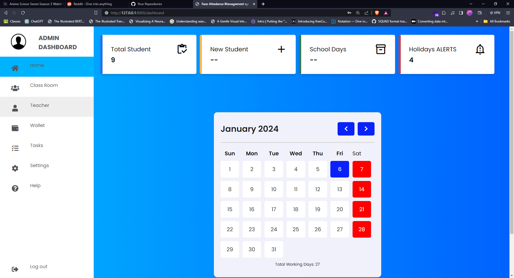
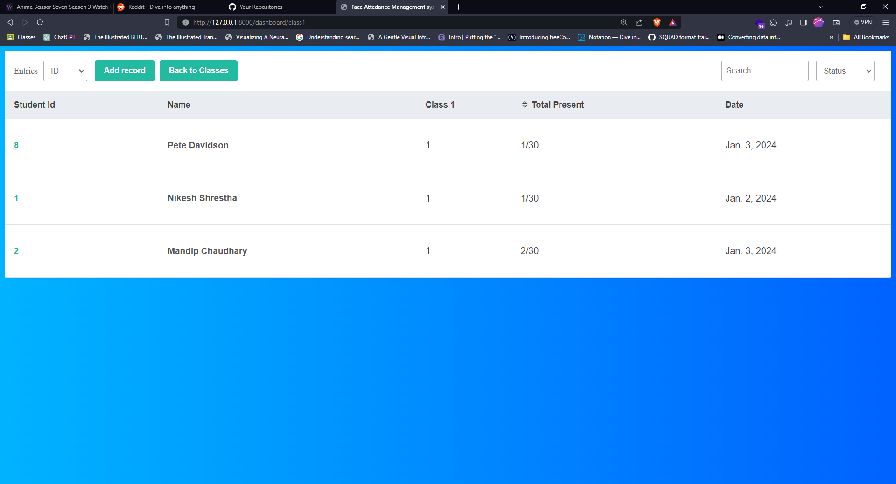

# Face Recognition Attendance System
# Kathfest-Hackathon project

## Team Phoenix

## Contributors
- [Yukesh panta](https://github.com/YukeshPanta)
- [Jyotsan Hamal](https://github.com/Jyotsan-Hamal)
- [Nikesh Shrestha](https://github.com/Nik-doid)
- [Mandeep chaudhary](https://github.com/Mandip69)
## Overview
This Face Recognition Attendance System is designed to automate attendance tracking using facial recognition technology. The system captures the face of students, recognizes them, updates their attendance in the database, and provides an admin dashboard built with Django for monitoring and managing student attendance.

## Requirements
- Python 3.8.18
- Conda (for Python version management)

## Installation
Install Python 3.8.18 using Conda:
```bash
conda install python=3.8.18
```
## Install required packages:
```bash
pip install -r requirements.txt

```
## Photos




## Usage
Configure the database settings in the Django project’s settings.py file.

Run the Django migrations to set up the database:

```
python manage.py migrate

```

## Start the Django development server:
```
python manage.py runserver

```
To Access the admin dashboard at http://localhost:8000/dashboard and log in with your credentials.you need to migrate and create a superuser in django
```
python manage.py createsuperuser
```

Add students, view their attendance, and manage the attendance records through the intuitive web interface.
## Face Recognition
The face recognition module uses state-of-the-art algorithms to recognize and match faces.
It uses OpenVino three models face-detection,landmarks-detection and face-recognition to recognise the face in video feed.
Ensure proper lighting conditions for accurate recognition.
## Notes
Make sure to handle database connection settings securely.

It is recommended to deploy this system in a secure environment to protect sensitive data.

This system can be extended to include additional features such as notifications, reporting, and more.


## Feel free to contribute to the project and make it more robust and feature-rich.

Disclaimer: This system is intended for educational purposes. Always comply with privacy and legal regulations when implementing facial recognition systems.
